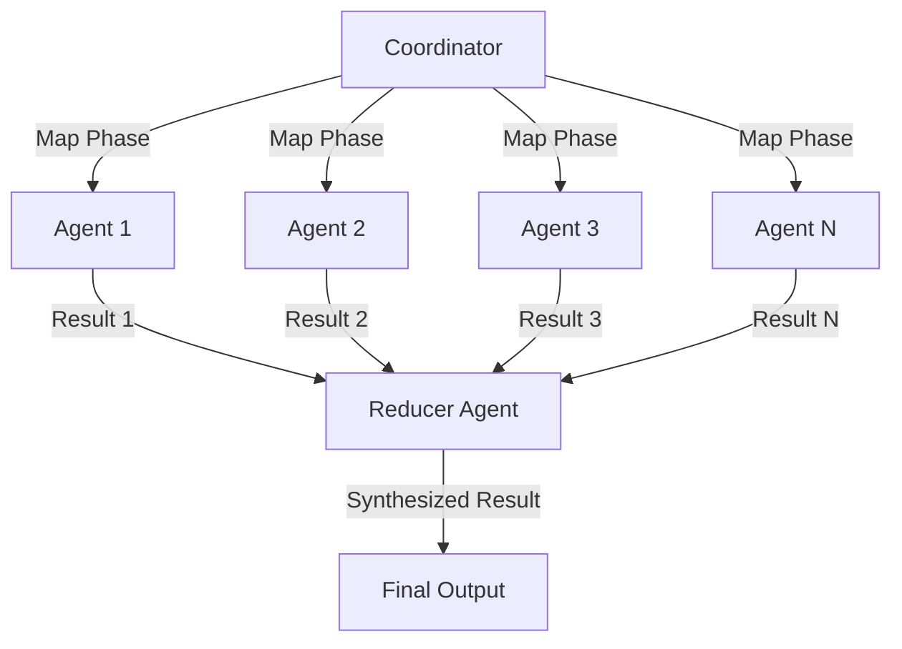
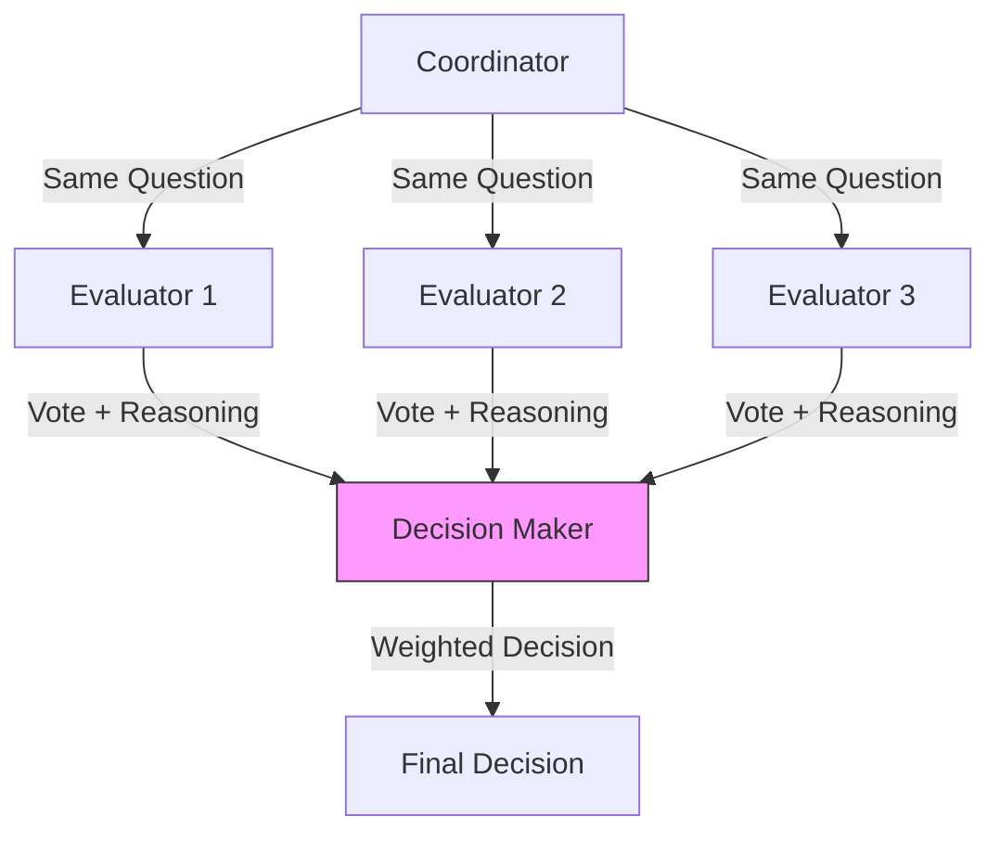
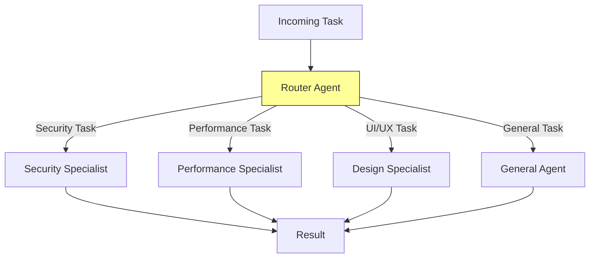

# Swarm Coordination Patterns

**Purpose**: Advanced patterns for coordinating multiple agents in complex workflows.

**When to read**: Designing multi-agent systems, implementing complex parallel workflows, or optimizing agent coordination.

---

## Table of Contents

1. [Map-Reduce Pattern](#map-reduce-pattern)
2. [Voting/Consensus Pattern](#votingconsensus-pattern)
3. [Specialist Router Pattern](#specialist-router-pattern)
4. [Anti-Patterns](#anti-patterns)
5. [Pattern Selection Guide](#pattern-selection-guide)

---

## Map-Reduce Pattern

### Overview

Parallel processing of independent subtasks followed by sequential aggregation.

**Use when:**
- Processing multiple independent items
- Each item can be handled in isolation
- Results need to be combined into a unified output

### Diagram



### Implementation

```typescript
// Map Phase: Launch parallel agents
const mapResults = await Promise.all([
  task({ agent: "agent", task: "Process item 1: [specific instructions]" }),
  task({ agent: "agent", task: "Process item 2: [specific instructions]" }),
  task({ agent: "agent", task: "Process item 3: [specific instructions]" }),
  // ... more items
]);

// Reduce Phase: Synthesize results
const finalResult = await task({
  agent: "agent",
  task: `REDUCE: Synthesize these ${mapResults.length} results into a unified output:

  Results:
  ${mapResults.map((r, i) => `[${i+1}] ${r}`).join('\n')}

  Create a cohesive summary that:
  - Identifies common themes
  - Highlights unique findings
  - Resolves any conflicts
  - Provides actionable insights`
});
```

### Example: Multi-File Analysis

```typescript
// Analyze 10 files for security issues
const files = ['auth.ts', 'api.ts', 'db.ts', /* ... */];

// Map: Each agent analyzes one file
const analyses = await Promise.all(
  files.map(file => task({
    agent: "agent",
    task: `Analyze ${file} for security vulnerabilities. Report: file, severity, location, description.`
  }))
);

// Reduce: Consolidate into security report
const report = await task({
  agent: "agent",
  task: `Create security report from these ${analyses.length} file analyses. Group by severity, deduplicate similar issues, prioritize remediation.`
});
```

---

## Voting/Consensus Pattern

### Overview

Multiple agents evaluate the same question, then a decision-maker synthesizes their votes.

**Use when:**
- Decision quality is critical
- Multiple perspectives reduce bias
- High-stakes or irreversible decisions

### Diagram



### Implementation

```typescript
// Phase 1: Gather independent evaluations
const evaluations = await Promise.all([
  task({
    agent: "agent",
    task: `Evaluate this decision independently: [QUESTION]

    Provide:
    - Your recommendation (A, B, or C)
    - Confidence level (1-10)
    - Key reasoning (3 points max)

    DO NOT hedge or say "it depends" - make a clear choice.`
  }),
  task({ agent: "agent", task: /* same question */ }),
  task({ agent: "agent", task: /* same question */ }),
]);

// Phase 2: Decision maker weighs votes
const decision = await task({
  agent: "agent",
  task: `DECISION MAKER: Synthesize these ${evaluations.length} evaluations:

  ${evaluations.map((e, i) => `[Evaluator ${i+1}] ${e}`).join('\n\n')}

  Weight by confidence level. Note any unanimous vs split decisions.
  Make final recommendation with rationale.`
});
```

### Example: Architecture Decision

```typescript
// Three agents evaluate framework choices
const question = "Should we use React, Vue, or Svelte for this project?";

const votes = await Promise.all([
  task({ agent: "agent", task: `${question} Evaluate from PERFORMANCE perspective. Vote with reasoning.` }),
  task({ agent: "agent", task: `${question} Evaluate from DEVELOPER EXPERIENCE perspective. Vote with reasoning.` }),
  task({ agent: "agent", task: `${question} Evaluate from ECOSYSTEM/COMMUNITY perspective. Vote with reasoning.` }),
]);

const decision = await task({
  agent: "agent",
  task: `Synthesize these three expert opinions and make final framework recommendation: ${votes.join('\n\n')}`
});
```

---

## Specialist Router Pattern

### Overview

Classifier agent routes tasks to specialized agents based on task characteristics.

**Use when:**
- Tasks vary significantly in nature
- Different expertise needed for different tasks
- Routing decisions aren't trivial

### Diagram



### Implementation

```typescript
// Phase 1: Classify the task
const classification = await task({
  agent: "agent",
  model: "haiku", // Fast classification
  task: `Classify this task into ONE category:

  Task: [USER TASK]

  Categories:
  - SECURITY: Authentication, authorization, vulnerabilities
  - PERFORMANCE: Speed, memory, optimization
  - UI_UX: Design, user experience, accessibility
  - ARCHITECTURE: System design, patterns, structure
  - GENERAL: Everything else

  Return ONLY the category name.`
});

// Phase 2: Route to specialist
const specialists: Record<string, string> = {
  SECURITY: "security-analyzer",
  PERFORMANCE: "performance-specialist",
  UI_UX: "designer",
  ARCHITECTURE: "architect",
  GENERAL: "agent",
};

const specialist = specialists[classification.trim()] || "agent";

const result = await task({
  agent: specialist,
  task: `[Original task with full context]`
});
```

### Example: Support Ticket Router

```typescript
// Route incoming support tickets to appropriate specialists
const ticket = "My API calls are taking 30 seconds to respond";

// Classify
const category = await task({
  agent: "agent",
  model: "haiku",
  task: `Classify support ticket: "${ticket}"

  Categories: BUG, PERFORMANCE, BILLING, FEATURE_REQUEST, GENERAL
  Return only the category.`
});

// Route and handle
const handlers = {
  BUG: { agent: "engineer", prompt: "Debug and provide fix for:" },
  PERFORMANCE: { agent: "engineer", prompt: "Analyze performance issue:" },
  BILLING: { agent: "agent", prompt: "Address billing concern:" },
  FEATURE_REQUEST: { agent: "architect", prompt: "Evaluate feature request:" },
  GENERAL: { agent: "agent", prompt: "Respond to:" },
};

const handler = handlers[category.trim()] || handlers.GENERAL;
const response = await task({
  agent: handler.agent,
  task: `${handler.prompt} "${ticket}"`
});
```

---

## Anti-Patterns

### 1. Sequential When Parallel is Possible

**Bad:**
```typescript
// Sequential - slow
const result1 = await task({ task: "Analyze file1.ts" });
const result2 = await task({ task: "Analyze file2.ts" });
const result3 = await task({ task: "Analyze file3.ts" });
```

**Good:**
```typescript
// Parallel - fast
const [result1, result2, result3] = await Promise.all([
  task({ task: "Analyze file1.ts" }),
  task({ task: "Analyze file2.ts" }),
  task({ task: "Analyze file3.ts" }),
]);
```

### 2. Forgetting Spotcheck After Parallel Work

**Bad:**
```typescript
await Promise.all([...10 parallel tasks...]);
// Done! But no verification...
```

**Good:**
```typescript
await Promise.all([...10 parallel tasks...]);
await task({ task: "SPOTCHECK: Verify all 10 tasks completed consistently..." });
```

### 3. Over-Engineering Simple Tasks

**Bad:**
```typescript
// Using voting pattern for simple lookup
const [vote1, vote2, vote3] = await Promise.all([
  task({ task: "What's the config file path?" }),
  task({ task: "What's the config file path?" }),
  task({ task: "What's the config file path?" }),
]);
// Synthesize votes... for a simple file lookup
```

**Good:**
```typescript
// Just ask once
const path = await task({ agent: "codebase-locator", task: "Find config file path" });
```

### 4. Vague Routing Without Clear Criteria

**Bad:**
```typescript
// Vague classification
const category = await task({ task: "Is this task hard or easy?" });
```

**Good:**
```typescript
// Clear, objective criteria
const category = await task({
  task: `Classify by these criteria:
  - FILE_LOOKUP: Task mentions specific filenames
  - CODE_CHANGE: Task requires modifying code
  - ANALYSIS: Task requires understanding behavior
  Return category only.`
});
```

### 5. No Context Sharing in Map Phase

**Bad:**
```typescript
// Agents work in isolation without shared context
await Promise.all([
  task({ task: "Update file1.ts" }),
  task({ task: "Update file2.ts" }),
  // Agents don't know about each other's changes
]);
```

**Good:**
```typescript
// Share the pattern/context with all agents
const pattern = "Add error handling with try/catch, log errors to console";
await Promise.all([
  task({ task: `Update file1.ts: ${pattern}` }),
  task({ task: `Update file2.ts: ${pattern}` }),
]);
```

---

## Pattern Selection Guide

| Scenario | Recommended Pattern |
|----------|---------------------|
| Process list of items | **Map-Reduce** |
| High-stakes decision | **Voting/Consensus** |
| Mixed task types | **Specialist Router** |
| Simple parallelization | Standard parallel + spotcheck |
| Need multiple perspectives | **Voting/Consensus** |
| Batch processing | **Map-Reduce** with batching |
| Dynamic routing needed | **Specialist Router** |

### Decision Tree

```
Is the task a single type or mixed types?
├─ Mixed types → Use Specialist Router
└─ Single type
    ├─ Is it a decision with multiple valid options?
    │   └─ Yes → Use Voting/Consensus
    └─ Is it processing multiple independent items?
        └─ Yes → Use Map-Reduce
```

---

## Related Documentation

- **delegation-guide.md** - Basic delegation patterns and spotcheck
- **agent-guide.md** - Agent hierarchy and escalation

---

**Remember**: Patterns are tools, not rules. Choose based on the problem, not habit.
