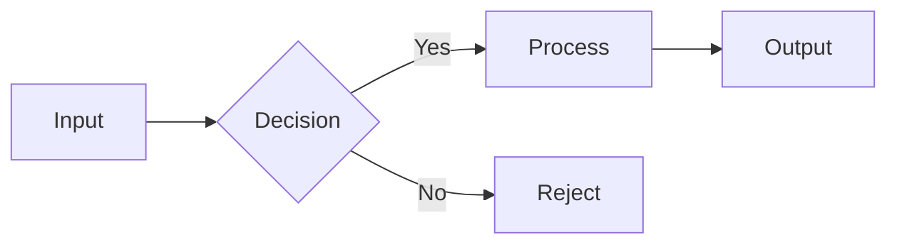
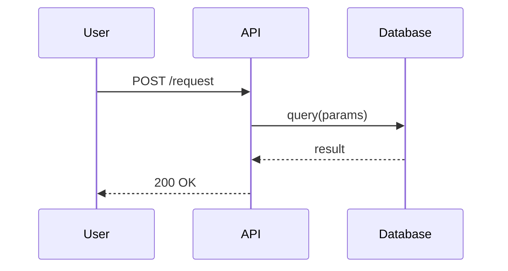

# Mermaid Diagram — Technical Diagram Workflow

Technical diagrams using Mermaid code. Architecture diagrams, data flows, sequences, state machines, class diagrams, ER diagrams. Mermaid diagrams are code — only fall back to image generation when Mermaid genuinely can't express the structure.

---

## Step 1: Understand What Needs Diagramming

Clarify the system or process being diagrammed:

1. **Subject** — What system, process, or relationship is being visualized?
2. **Audience** — Developer, designer, student, stakeholder?
3. **Level of detail** — Overview or deep-dive? (fewer nodes = clearer overview)
4. **Context** — Will this appear in docs, a slide deck, a course, a GitHub README?
5. **Direction** — Left-to-right or top-to-bottom? (most flow diagrams read left-to-right)

---

## Step 2: Choose Mermaid Diagram Type

| What to Diagram | Mermaid Type | Syntax Keyword |
|---|---|---|
| Process or system flow | Flowchart | `flowchart LR` or `flowchart TD` |
| API calls, interactions between systems | Sequence diagram | `sequenceDiagram` |
| Object structure, interfaces | Class diagram | `classDiagram` |
| Application or workflow state | State machine | `stateDiagram-v2` |
| Database schema | ER diagram | `erDiagram` |
| Project schedule | Gantt chart | `gantt` |
| User journey, steps | User journey | `journey` |
| Hierarchical structure | Mindmap | `mindmap` |

If the structure doesn't clearly fit one type, use `flowchart` — it's the most expressive and readable default.

---

## Step 3: Write the Mermaid Code

Write clean, readable Mermaid following these principles:

**Clarity over completeness.** Remove nodes that add noise, not signal.

**Naming conventions:**
- Node IDs: `camelCase` or `snake_case`, no spaces
- Labels: Clear English in brackets, e.g., `A[User Request]`
- Arrows: `-->` for flow, `--text-->` for labeled edges, `-.->` for optional/dashed

**Structure rules:**
- Group related nodes with `subgraph`
- Use `direction` to control layout: `LR` (left-right) for most flows, `TD` (top-down) for hierarchies
- Keep subgraphs bounded — they should cluster related concerns, not just visually decorate

**Example patterns:**





---

## Step 4: Apply Theme Colors

Mermaid's `%%{init: ...}%%` directive applies brand-consistent colors.

**TGDS theme** (for design education content, course docs, TGDS materials):

```
%%{init: {
  "theme": "base",
  "themeVariables": {
    "primaryColor": "#2E00B2",
    "primaryTextColor": "#FFFFFF",
    "primaryBorderColor": "#1C0089",
    "lineColor": "#222222",
    "secondaryColor": "#FFE900",
    "secondaryTextColor": "#222222",
    "tertiaryColor": "#F2F2F2",
    "background": "#FFFFFF",
    "nodeBorder": "#2E00B2"
  }
}}%%
```

**CORE theme** (for general PAI use, non-TGDS technical docs):

```
%%{init: {
  "theme": "base",
  "themeVariables": {
    "primaryColor": "#E8652A",
    "primaryTextColor": "#2A2520",
    "primaryBorderColor": "#C44030",
    "lineColor": "#4A443D",
    "secondaryColor": "#2B8A8A",
    "secondaryTextColor": "#FAF9F7",
    "tertiaryColor": "#F2EDE6",
    "background": "#FAF9F7",
    "nodeBorder": "#E8652A"
  }
}}%%
```

Place the `%%{init}%%` block at the top of the Mermaid code block.

---

## Step 5: Render the Diagram

**Option A — Embed in Markdown or HTML:**

Wrap the Mermaid code in a fenced code block:

````markdown

````

GitHub, Obsidian, and many documentation tools render this natively.

**Option B — Render to image via CLI (if a static image is needed):**

If the environment doesn't render Mermaid natively, use the Mermaid CLI tool `mmdc`:

```bash
mmdc -i diagram.mmd -o diagram.png -w 1600 -H 900 --backgroundColor white
```

Or with a theme config file:

```bash
mmdc -i diagram.mmd -o diagram.png -C mermaid-theme.json
```

---

## Step 6: Fallback to Image Generation

Use `generate-image.ts` only when Mermaid genuinely cannot express the diagram:

- Visual style is the primary concern (decorative, artistic, brand-heavy)
- The diagram requires custom shapes Mermaid doesn't support
- The diagram needs photorealistic elements combined with structure
- The output is for a context where Mermaid won't render (e.g., a JPEG export for a deck)

When falling back, use `nano-banana-pro` — text and structural accuracy are essential for technical diagrams:

```bash
bun run ${PAI_DIR}/skills/image/tools/generate-image.ts \
  --model nano-banana-pro \
  --prompt "<technical-diagram-prompt>" \
  --slug <diagram-name> \
  --size 2K \
  --aspect-ratio 16:9 \
  [--project <path>]
```

---

## Step 7: Validate Diagram Accuracy

Before presenting to JM:

1. Trace every flow path — does it accurately represent the system/process?
2. Verify node labels use the correct terminology for the domain
3. Check arrow directions — data flow arrows should point in the direction data travels
4. Confirm subgraph boundaries group logically related concerns
5. Verify the diagram is readable at its intended display size — if nodes are too dense, simplify

Accuracy over completeness — a correct overview beats an inaccurate detail diagram.

---

## Quick Reference

| JM says... | Diagram Type | Theme |
|---|---|---|
| "architecture diagram for the PAI hook system" | `flowchart LR` | CORE |
| "sequence diagram for the API authentication flow" | `sequenceDiagram` | CORE |
| "state machine for the onboarding flow" | `stateDiagram-v2` | TGDS or CORE |
| "ER diagram for the course database" | `erDiagram` | TGDS |
| "diagram for the design process" | `flowchart TD` | TGDS |
| "Gantt for the course launch project" | `gantt` | TGDS or CORE |
